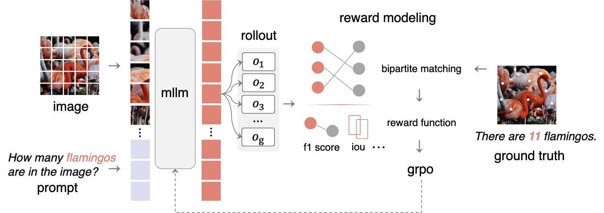
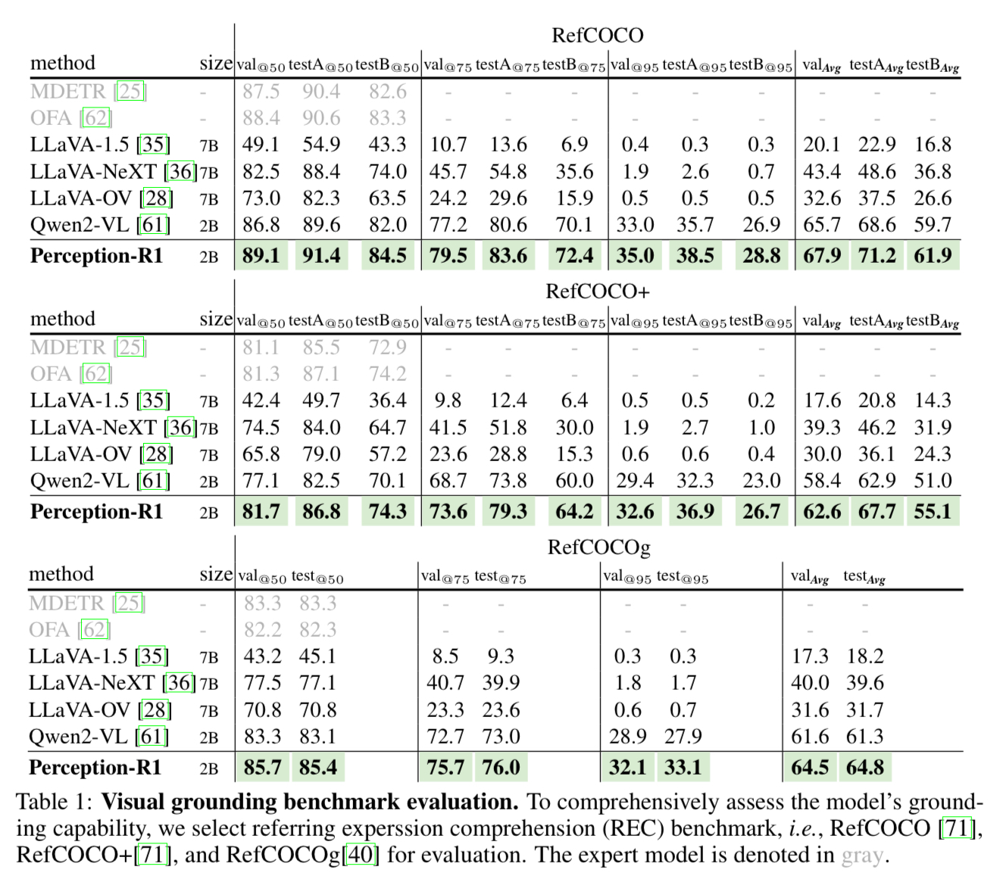
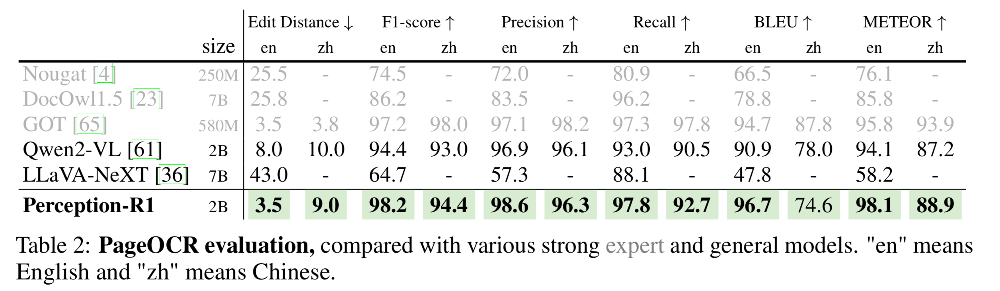
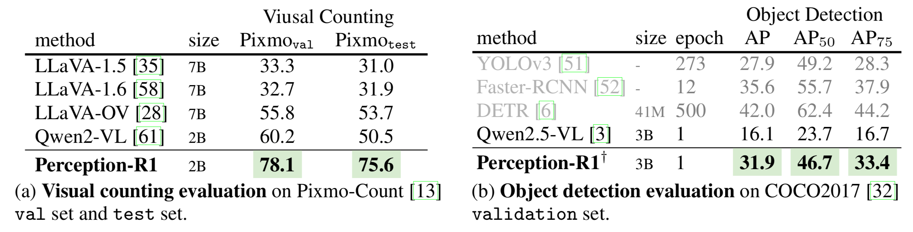
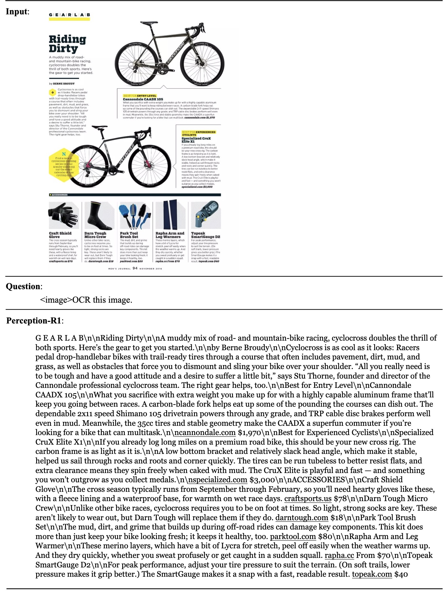
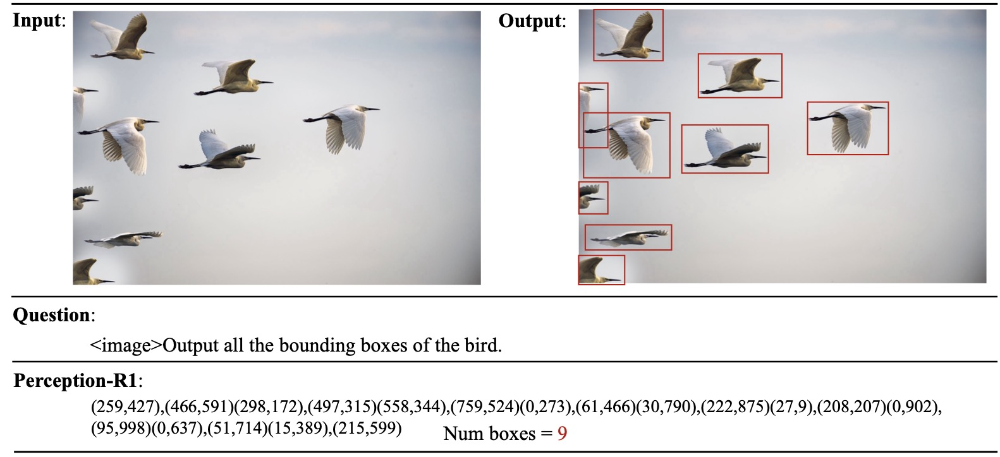
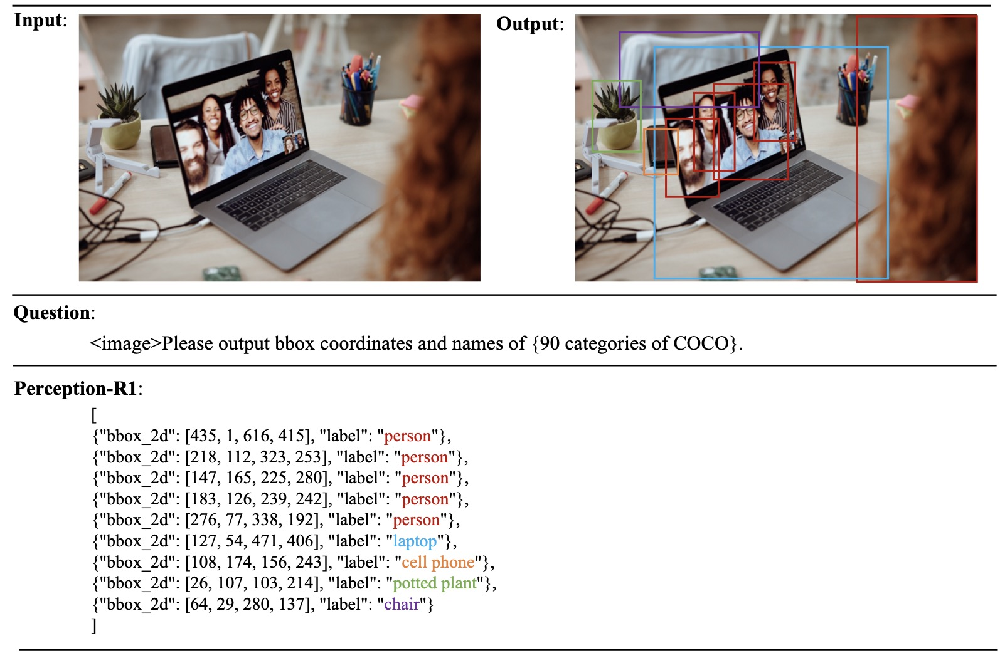
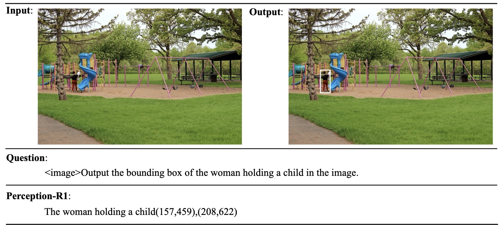

<div align="center" style="font-family: charter;">

<h1> <i>Perception R1</i>:</br>Pioneering Perception Policy with Reinforcement Learning</h1>



<br />

<a href="https://arxiv.org/abs/2504.07954" target="_blank">
    
</a>
<a href="" target="_blank">
    
</a>
<a href="https://huggingface.co/collections/Kangheng/perception-r1-67f6b14f89d307a0ece985af" target="_blank">
    
</a>
<a href="https://huggingface.co/collections/Kangheng/perception-r1-67f6b14f89d307a0ece985af" target="_blank">
    
</a>

<div>
    <a href="https://scholar.google.com/citations?user=rWCQMNgAAAAJ&hl=en" target="_blank">En Yu</a><sup>1*</sup>,</span>
    <a href="" target="_blank">Kangheng Lin</a><sup>2*</sup>,</span>
    <a href="" target="_blank">Liang Zhao</a><sup>3*</sup>,</span>
    <a href="" target="_blank">Jisheng Yin</a><sup>3</sup>,</span>
    <a href="" target="_blank">Yana Wei</a><sup>4</sup>,</span>
    <a href="" target="_blank">Yuang Peng</a><sup>5</sup>,
    <a href="" target="_blank">Haoran Wei</a><sup>3</sup>,
    <a href="" target="_blank">Jianjian Sun</a><sup>3</sup>,
    <a href="" target="_blank">Chunrui Han</a><sup>3</sup>,
    <a href="" target="_blank">Zheng Ge</a><sup>3</sup>,
    <a href="" target="_blank">Xiangyu Zhang</a><sup>3</sup>,
    <a href="" target="_blank">Daxin Jiang</a><sup>3</sup>,
    <a href="" target="_blank">Jingyu Wang</a><sup>2</sup>,
    <a href="" target="_blank">Wenbing Tao</a><sup>1</sup>
</div>

<div>
    <sup>1</sup>HUST
    <sup>2</sup>BUPT
    <sup>3</sup>StepFun
    <sup>4</sup>JHU
    <sup>5</sup>THU
</div>

</div>

# 📖 Overview
We present Perception-R1, a scalable RL framework using Group Relative Policy Optimization (GRPO) during MLLM post-training. Key innovations:

🎯 **Perceptual Perplexity Analysis**: We introduce a novel analytical framework that reveals critical thresholds for effective reinforcement learning in perception tasks, providing insights into when and how RL can improve visual understanding.

🚀 **GRPO Optimization**: Scalable policy learning with meticulously crafted rule-based reward shaping.

🔥 **Surprising Performance**: Perception-R1 achieves remarkable improvements across multiple visual perception benchmarks, notably reaching 31.9% mAP on COCO2017 validation set - making it the first 3B-scale MLLM to achieve such performance.

## TODOS
- [x] `2025-04-10` 🎄: Initial release of Perception-R1 models and evaluation code.
- [x]  🧐: Release the training code and datas of Perception-R1 on grounding task.
- [x] `2025-05-27` 🎉: Additional perception tasks coming soon (detection, OCR, counting...)


# 🛠️Installation
```bash
# Create and activate a new conda environment
conda create -n pr1 python=3.10 -y  
conda activate pr1

# Clone the repository and install dependencies
git clone https://github.com/linkangheng/PR1.git
cd PR1
pip install -e ".[dev]"
pip install flash-attn==2.7.0.post2 --no-build-isolation
```

# 🔄Training
Before training, modify the script to specify your model and data paths. Then run the experiment using:
```bash
bash local_scripts/train/train_qwen2_2b_vl_grounding.sh
```
The training script includes comprehensive configurations for hyperparameters, data loading, and model checkpointing. For custom training scenarios, you can adjust parameters such as learning rate, batch size, and optimization settings directly in the script.

# 📊Evaluation

## Preparation
Download the evaluation datas from [🤗huggingface](https://huggingface.co/datasets/Kangheng/PR1-Datasets-Grounding), and then unzip them in the `eval/` folder. The directory structure should be:

> **Important**: The COCO images are not included in the package and must be downloaded separately. Please download the COCO images from the official [COCO](https://cocodataset.org/#download) website and place them in the `eval/images/coco/` directory.

```bash
eval/
├── images/
│   ├── coco/
│   ├── pixmo-count/
│   └── ocr/
└── jsons/
    ├── counting/
    ├── grounding/
    ├── ocr/
    └── detection/
```
## Running Evaluations
### Counting Evaluation

```bash
python eval/evaluate_counting.py \
    --model_path 'Kangheng/PR1-Qwen2-VL-2B-Counting' \
    --anno_dir 'eval/jsons/counting/' \
    --image_dir 'eval/images/'
```

### Grounding Evaluation
```bash
python eval/evaluate_grounding.py \
    --model_path 'Kangheng/PR1-Qwen2-VL-2B-Grounding' \
    --anno_dir 'eval/jsons/grounding/' \
    --image_dir 'eval/images/coco/'
```

### Detection Evaluation
```bash
pip install pycocotools
python eval/evaluate_detection.py \
    --model_path Kangheng/PR1-Qwen2.5-VL-3B-Detection \
    --anno_dir 'eval/jsons/detection/coco_val2017.json' \
    --image_dir 'eval/images/coco/val2017/'
```
### OCR Evaluation
```bash
python eval/evaluate_ocr.py \
    --model_path Kangheng/PR1-Qwen2-VL-2B-OCR \
    --anno_dir 'eval/jsons/ocr/' \
    --image_dir 'eval/images/ocr/'
```

# 📈Results
## Grounding


## OCR


## Counting and Detection


# Some Cases 





# Acknowledgement

This work builds upon several important open-source projects. We would like to acknowledge the following repositories that inspired our research:
- [R1-V](https://github.com/Deep-Agent/R1-V)
- [R1-Multimodal-Journey](https://github.com/FanqingM/R1-Multimodal-Journey/tree/main)
- [open_r1](https://github.com/huggingface/open-r1)

# 📚Citation

If you find our paper and code useful in your research, please consider giving us a star ⭐ and citing our work ✏️:
```bibtex
@article{yu2025perception,
  title={Perception R1: Pioneering Perception Policy with Reinforcement Learning},
  author={Yu, En and Lin, Kangheng and Zhao, Liang and Yin, Jisheng and Peng, Yuang and Wei, Haoran and Sun, Jianjian and Han, Chunrui and Ge, Zheng and Zhang, Xiangyu and Jiang, Daxin and Wang, Jingyu and Tao, Wenbing},
  journal={arXiv preprint arXiv:2504.07954},
  year={2025}
}
```
